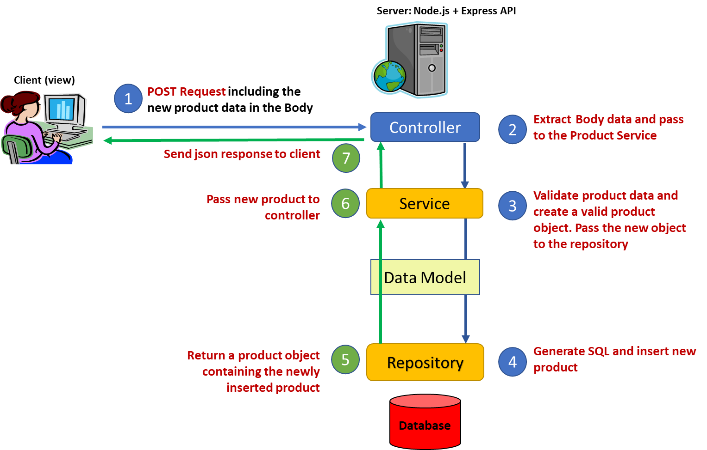

# Web API Lab: Build a RESTful web API using Node, Express, and an SQL DB

## Create new products.

## Introduction

This lab continues from the previous one. The next step is to add new products
the SQL DB using a **POST** request.

The body of the POST request will include the values for a new product which
need to be validated and inserted using SQL.

The web API will use SQL commands to accomplish the above but that will be
hidden from users of the API who will only see the HTTP interface.



Start with the completed Node Express Web API to date:

https://github.com/elee-tudublin/SQLite-db-api-2021.part3

## 1. The controller

Open the existing product controller file: **controllers/productController.js**

Now add a function (or modify the empty function if it already exists) to handle
**POST** requests to the default route in this controller. This is in addition
to the exiting route for **GET /** The HTTP request method will determine which
route is used.

Data is accepted as **JSON** from the request body. Use the **express.json()**
middleware to enable support for different body content types. In **app.js**:


### Here is the code to handle POST requests to the default route (/)

Read the comments carefully, then add to the Product Controller.

```javascript
/* Handle HTTP POST requests for '/'
/* this endpoint is for adding new products
*/
router.post("/", async (req, res) => {
  // the request body contains the new product values - copy it
  const newProduct = req.body; // show what was copied in the console (server side)

  console.log("productController: ", newProduct); // Pass the new product data to the service and await the result

  try {
    // Use the service to create the new product
    // If all goes well, return the result 
    result = await productService.createProduct(newProduct);
    console.log('new: ', result);
    res.json(result); 
  
  // Otherwise handle server (status 500) errors
  } catch (err) {
    res.status(500);
    res.send(err.message);
  }
});

```

## 2. The Product Service + validation

The service layer is responsible for application logic, validation, etc. It also
calls the Repository layer for database access.

The validation part will be separated into its own section to avoid code
clutter.

### Validation

In the code above you should see that a separate product validator was called to
check the product data before attempting a save. This is to avoid cluttering up
the product service, making it easier to read. It will also be helpful if we
need to make changes to how data is validated in the future.

1.  Add new folder, named **validators**, to the root of the application.

    
    
2.  Then add a new JS file, **productValidators.js** to the folder.

### Code for productValidators.js

The product validator includes the **```validateId()```** function, moved from the
product service, plus a new **```validateProduct()```** function to validate a new
product. This may look complex, but it is just a big **if statement** – check
the validator documentation for details.

After successful validation, a new **Product model** **object** is created,
filled with the valid data, and returned.

```javascript
// for documentation see: https://www.npmjs.com/package/validator
const validator = require("validator");

// models
const Product = require('../models/product.js');

// function to validate an id
// An id is a positive number with no sign (+,-, etc.)
// return Not a number or else cast as Number and return
//
function validateId(num) {
  if (validator.isNumeric(num, { no_symbols: true })) {
    return Number(num);
  }
  return NaN;
}

// Validate the body data, sent by the client, for a new product
// formProduct represents the data filled in a form
// It needs to be validated before using in gthe application
function validateNewProduct(formProduct) {
    // Declare constants and variables
    let validatedProduct;

    // debug to console - if no data
    if (formProduct === null) {
        console.log("validateNewProduct(): Parameter is null");
    }
    // Validate form data for new product fields
    // Creating a product does not need a product id
    // Adding '' to the numeric values makes them strings for validation purposes ()
    // appending + '' to numbers as the validator only works with strings
    if (
        validator.isNumeric(formProduct.category_id + '', { no_symbols: true, allow_negatives: false }) && 
        !validator.isEmpty(formProduct.product_name) && 
        !validator.isEmpty(formProduct.product_description) && 
        validator.isNumeric(formProduct.product_stock + '', { no_symbols: true, allow_negatives: false }) && 
        validator.isCurrency(formProduct.product_price + '', { no_symbols: true, allow_negatives: false }))
    {
        // Validation passed
        // create a new Product instance based on Product model object
        // no value for product id (passed as null)
        validatedProduct = new Product(
                null,
                formProduct.category_id,
                // escape is to sanitize - it removes/ encodes any html tags
                validator.escape(formProduct.product_name),
                validator.escape(formProduct.product_description),
                formProduct.product_stock,
                formProduct.product_price
            );
    } else {
        // debug
        console.log("validateNewProduct(): Validation failed");
    }
    // return new validated product object
    return validatedProduct;
}

// Module exports
// expose these functions
module.exports = {
  validateId,
  validateNewProduct
};

```

The new product validator must now be referenced in **productService.js** so
that its functions can be accessed.


### Here is the new createProduct() function to be added to **productservice.js**

Read the comments carefully

```javascript
// Validate data and insert a new product
// This function accepts product data as a paramter from the controller.
async function createProduct(product) {
  // declare variables
  let newlyInsertedProduct;
  
  // Call the product validator - kept seperate to avoid clutter here
  let validatedProduct = productValidator.validateNewProduct(product); 
  
  // If validation returned a product object - save to database
  if (validatedProduct != null) {
    newlyInsertedProduct = await productRepository.insertProduct(
      validatedProduct
    );
  } else {
    // Product data failed validation
    newlyInsertedProduct = { error: "invalid product" }; // log the result

    console.log("productService.createProduct(): form data validate failed");
  } // return the newly inserted product
  return newlyInsertedProduct;
}

// Module exports
// expose these functions
module.exports = {
  getProducts,
  getProductById,
  getProductsByCatId,
  createProduct,
};

```

## 3. The Product Repository

This is the part of the application which performs CRUD operations on the
database using SQL.

### Open **repositories/productRepository.js** for editing

The insert will use the **SQL_INSERT** query. Note that it has two statements to
insert and then select the new product. This is in case the new product id, not
available until after insert, is required. Put **SQL_INSERT** with the other SQL
constants near the top:

```sql
const SQL_INSERT = 'INSERT INTO product (category_id, product_name, product_description, product_stock, product_price) VALUES (@cat_id, @name, @description, @stock, @price);';
```

### The **insertProduct()** function

Add this function (or update if it exists). This function:

1.  Accepts a Product model object as a parameter.

2.  Fills the query parameter.

3.  Executes the SQL to insert a new product.

Copy the code below and add to the **```insertProduct()```** function after reading
the code comments.

```javascript
// Insert a new produt and return it
//
function insertProduct(product) {
    let newProduct;

    // execute SQL
    try {
        // Prepare the SQL satement
        const insert = dbConn.prepare(SQL_INSERT)

        // set the sql paramaters and execute
        const result = insert.run({
            cat_id: product.category_id, 
            name: product.product_name, 
            description: product.product_description, 
            stock: product.product_stock, 
            price: product.product_price
        });

        // Get the newly inserted product, using lastInsertRowid
        newProduct = getProductById(result.lastInsertRowid);

    // Catch and log errors to server side console 
    } catch (err) {
        console.log('DB Error - get all products: ', err.message);
    } finally {

    }
    // return the new product
    return newProduct;
}

// Export 
module.exports = {
    getProducts,
    getProductById,
    getProductsByCatId,
    insertProduct
};
```

### Testing Insert

This is a bit difficult to do in a web browser as headers would need to be
modified in developer tools. Instead of that we will use an API testing tool
called Insomnia. Download the free version from <https://insomnia.rest/> then
install.

#### 1. Add a new request collection


#### 2. Add a new request


#### 2. Name the Request (and set method to GET).


#### 3. Make a request to get all products.


### 

### Using Insomnia to send a POST request:

#### First add a new request named create product

set the request method to **POST** and the body data type to JSON:


#### Then add the endpoint as some **JSON** data in the request body

Note there is no **\_id**


#### Check that the request **Content-Type** header is set correctly.


#### Send the request.

If all goes well the request will send and the response will display the data
inserted.


#### Verify that the data was inserted.

Make a request to get all products via Insomnia (a browser will also work).


## Exercises

Add functionality for the following:

1.  **Update a Product.**

    This is very similar to insert/ POST but uses a **HTTP PUT request**. also
    sends the existing **Product id** (in addition to the data sent for insert)
    of the product to be updated, in the request body. Add the function and test
    with Insomnia.

2.  **Deleting a Product.**

    This is very similar to getting a single product but uses the **HTTP
    DELETE** method instead of **GET**. Add the function and test with Insomnia.

3.  **Use Insomnia to test the new endpoints.**
