# Web API Lab: Show Products by Category 
*Enda Lee 2021*

## 1. Introduction & Prerequisites

Currently the client website displays a list of all the products from the database. In this lab you will add the ability to filter by Category.

**Client-side:**

Start with the completed client website from the previous client lab:

https://github.com/elee-tudublin/SQLite-Client-WebApp-part1.2021-DisplayProducts

**Server side:** 

The client functionality is dependent on a server API with Category and Product endpoints.

Start with the completed server API to date:

https://github.com/elee-tudublin/SQLite-db-api-part1.2021-db-part2

**Keep the** **client and server applications -** **open them in separate VS Code instances when working on this lab.**

The finished client will retrieve the current list of categories from the database and display them in the left menu.

Each category will be a link – when clicked a JavaScript function will retrieve and display products for that category.

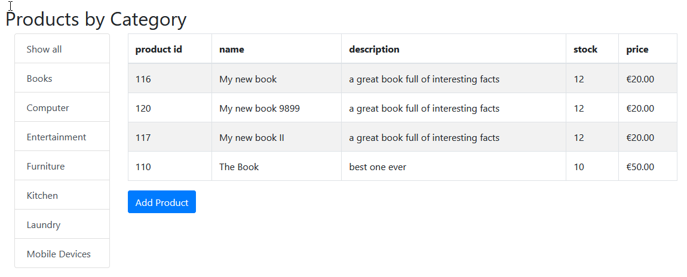

## 2. Server Side

The client-side application will need a list of categories and also the products from whichever category is selected (by category_id). Start by adding the required functionality to the server side.

### 2.1 Serving categories from the API

Similiar tp products, requests for categories will be sent from the client browser to an API endpount which will handle the request and return a list of **categories** in **JSON** format. The functionality will require a Category **Controller**, **Service**, and **Repository**.

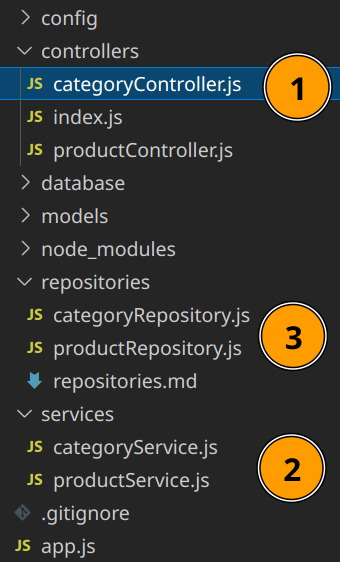


Duplicate the **Product** version of each and modify for **Category**. Most of the required functionality is the same, refer to the product API lab for details.

**```CategoryController.js```**

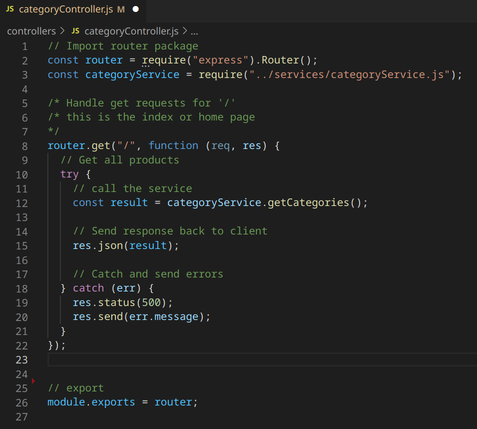


Add a route to the application, app.js, to forward requests for **/catgeory** to the new  controller

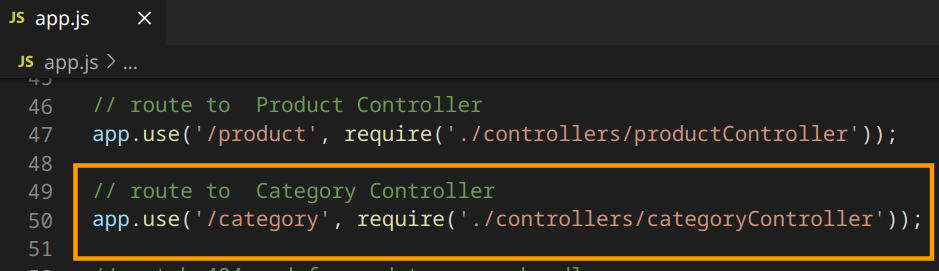


**```categoryService.js```**

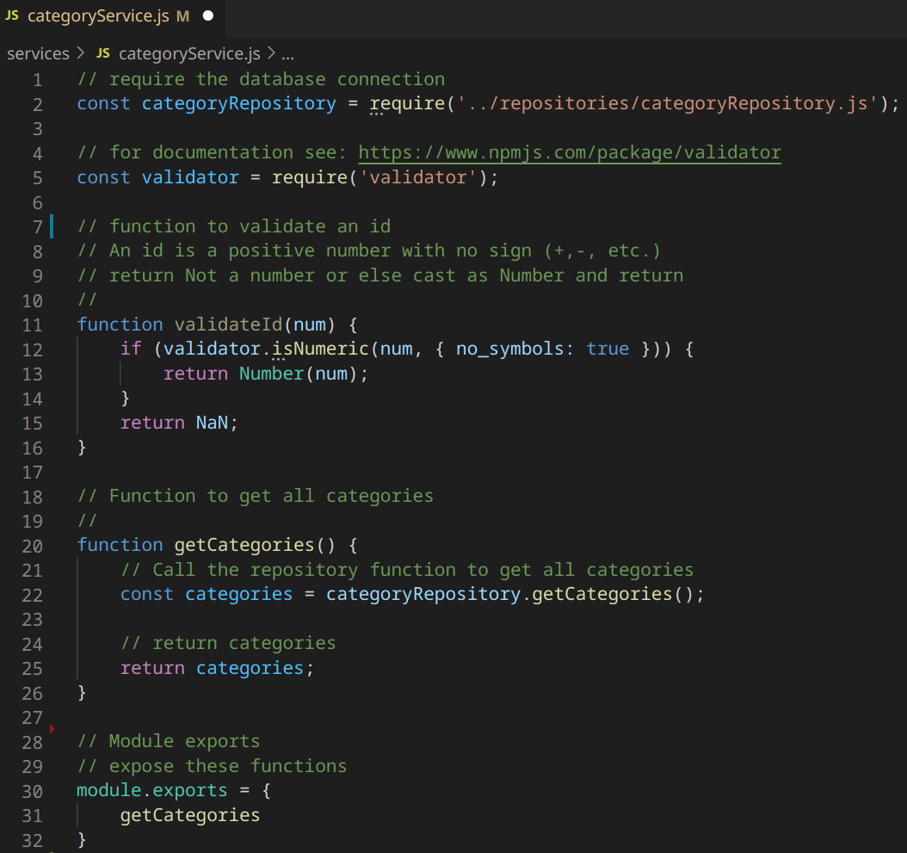


**```categoryRepository.js```**

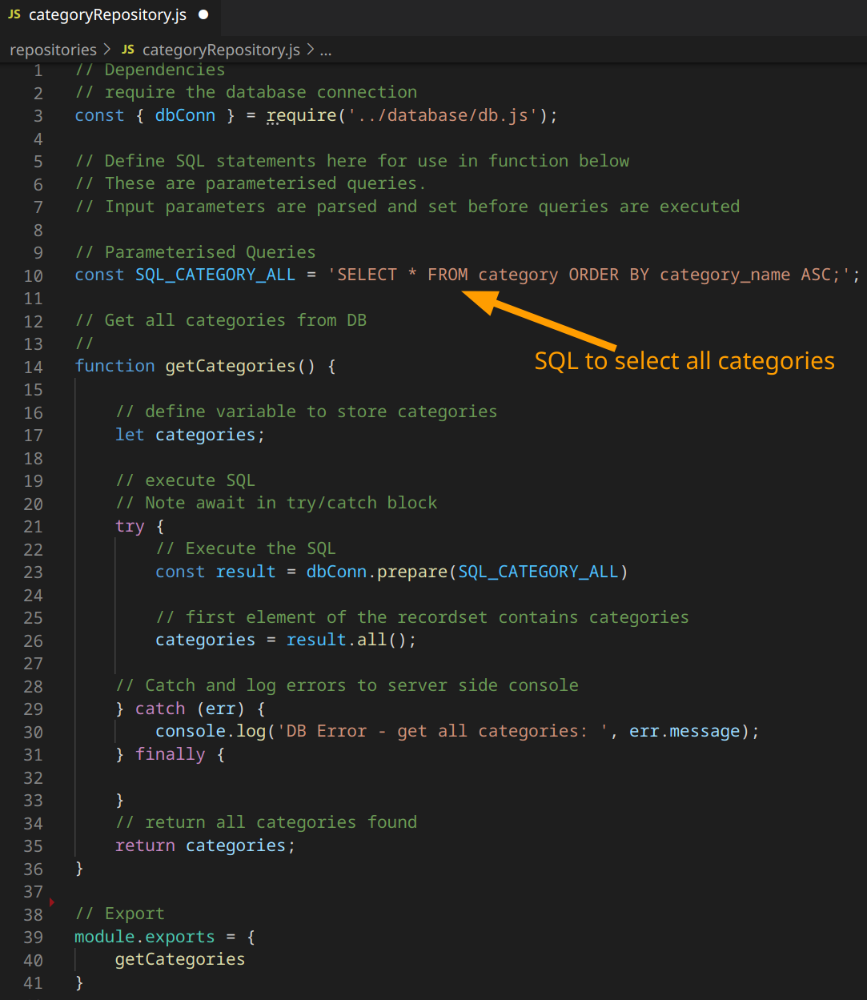


### 2.2 Get Broducts by Category ID

1. Add an end-point to the **Product Controller** to handle requests for **products by category id.**

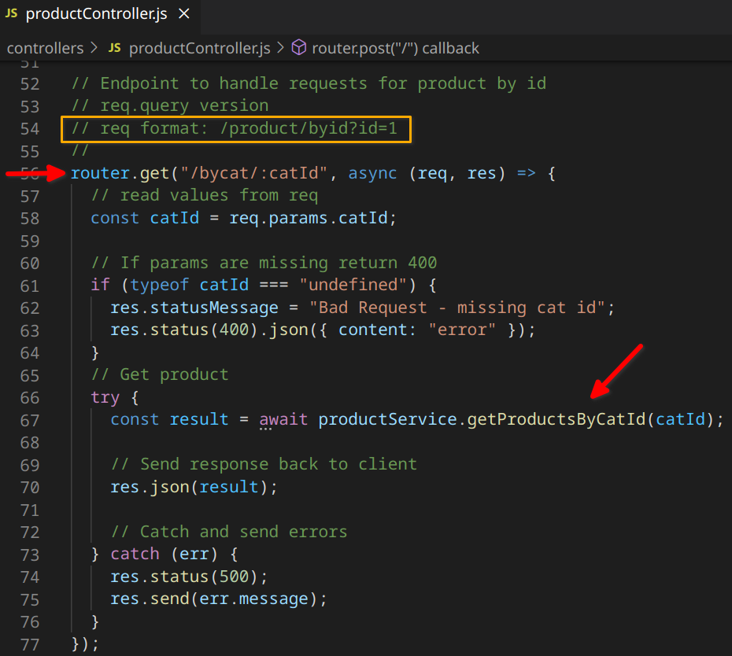

2. Add the **service** function

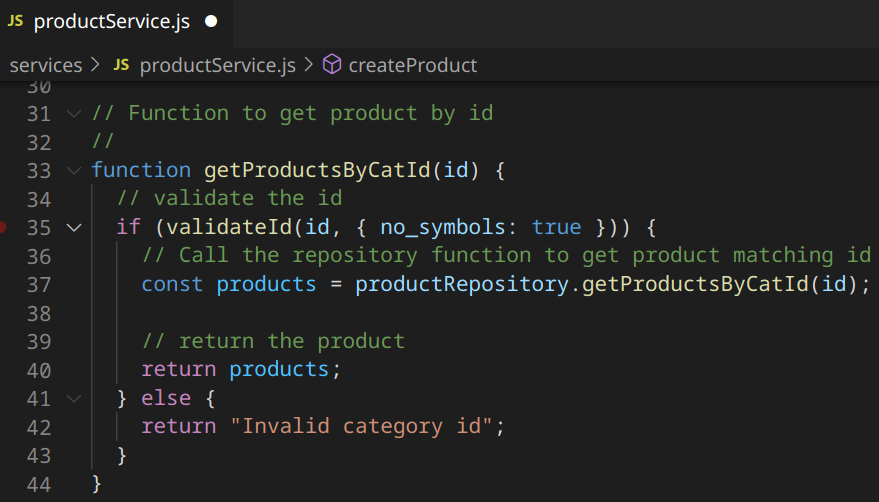

3. The **repository** function

   The SQL

   ```sqlite
   const SQL_PRODUCT_BY_CATID = 'SELECT * FROM product WHERE category_id = ? ORDER BY product_name ASC;'; 
   ```

   The function

   ```javascript
   // Get products from DB by cat id
   //
   function getProductsByCatId(catId) {
       // define variable to store products
       let products;
       // execute SQL
       // Note await in try/catch block
       try {
           // Execute the SQL
           const result = dbConn.prepare(SQL_PRODUCT_BY_CATID)
           // first element of the recordset contains products
           products = result.all(catId);
       // Catch and log errors to server side console 
       } catch (err) {
           console.log('DB Error - get all products: ', err.message);
       } finally {
       }
       // return all products found
       return products;
   }
   ```

### 2.3 Test the new API endpoints

1. Request the endpoint to rerieve all categories in a web browser. The result should be a JSON array containg all the categories in your database.

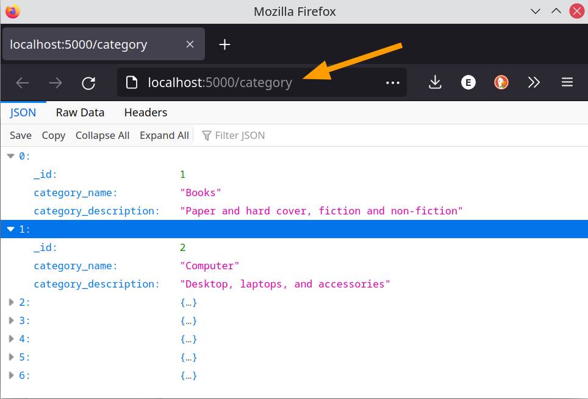

2. Request products in the books category (_id = 1)

   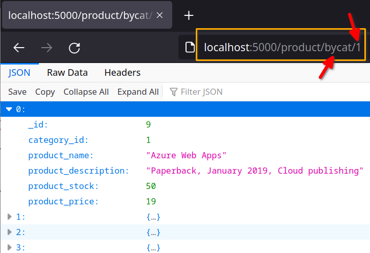

   


## 3. Client Side

First open the **client website folder** in VS Code. Then open **index.html**

Find the left side menu – a **div** element with **```id="categoryList"```** This is where the category links will be added, replacing the current placeholders

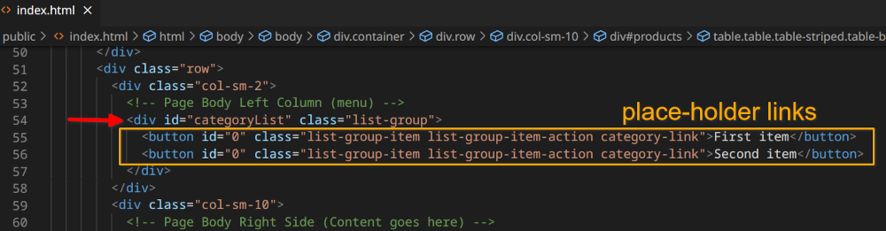


### 3.1 Display Categories

Open the **/javascript/scripts.js** for editing.

1. Modify the **```loadProducts()```** function so that it also loads categories.

   This is very similar to the existing code used to load products but fetches its data from the **category controller**.

   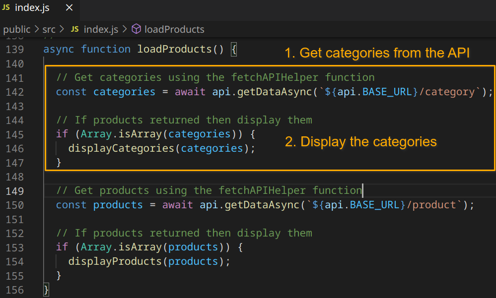 

   Note that **```${api_BASE_URL}```** should be set to the base api server, e.g. **```http://localhost:5000```**

2. Add the **```displayCategories()```** function.

   This function will take a list of categories and add a link to the left side menu for each one. **```displayCategories()```** is called in **```loadProducts()```** after the **categories** are retrieved.

   Note the use of a **data attribute** for category_id. This is because the id value for a page element must be unique and values like 1,2,3, etc. may have been used elsewhere.

   ```javascript
   // 1. Parse JSON
   // 2. Create category links
   // 3. Display in web page
   //
   function displayCategories(categories) {
   
     // Use the Array map method to iterate through the array of categories (in json format)
     const catLinks = categories.map((cat) => {
       // return a link button for each category, setting a data attribute for the id
       // the data attribute is used instead of id as an id value can only be used once in the document
       // note the category-link class used to identify the buttons
       return `<button data-category_id="${cat._id}" 
       		 class="list-group-item list-group-item-action category-link">
       		 ${cat.category_name}
       		</button>`;
     });
   
     // Add a link for all products to start of array
     if (Array.isArray(catLinks)) {
       catLinks.unshift(`<button data-category_id="0" 
                           class="list-group-item list-group-item-action category-link">
                           All Products
                         </button>`);
     }
   
     // Set the innerHTML of the productRows root element = rows
     // join('') converts the rows array to a string, replacing the ',' delimiter with '' (blank)
     document.getElementById('categoryList').innerHTML = catLinks.join("");
   } // End function
   ```

   

3.  Test

   At this point, test the application. Start the **server API** and the client application.

   A list of categories should be displayed in the page. Right click one of the category links and **inspect element** to see its HTML in the browser developer tools.

   Note  **data-category_id** is set for each button element and that the **class** attribute includes **category-link**.

   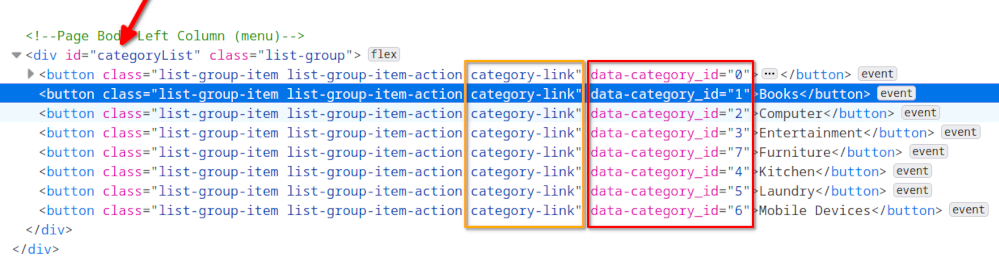

   

### 3.2 Filter Products by Category

In tis section you will add the **```filterProducts()```** function. This is responsible for updating the page so that only products from a single category are displayed.

The function gets the **category_id** data value, when one of the links is clicked, and it uses to retrieve products from the **/product/bycat/:id** endpoint.

The list of retrieved products is then passed to the existing **```displayProducts()```** function which updates the view.

1. First **add event listeners** to to **category-link** buttons by modifying **```displayCategories()```** add this code to the end:

   ```javascript
     // Add Event listeners
     //
     // 1. Find button all elements with matching class name
     const catButtons = document.getElementsByClassName('category-link');
   
     // 2. Assign a 'click' event listener to each button
     // Both arrays have same length so only need 1 loop
     for (let i = 0; i < catButtons.length; i++) {
       catButtons[i].addEventListener('click', filterProducts);
     }
   ```


2. Add the **```filterProducts()```** function

```javascript
//
// Filter products by category
//
async function filterProducts() {

    // Get id of cat link (from the data attribute)
    // https://developer.mozilla.org/en-US/docs/Learn/HTML/Howto/Use_data_attributes
    const catId = Number(this.dataset.category_id);

    // validation - if 0 or NaN reload everything
    if (isNaN(catId) || catId == 0) {
      loadProducts();
    // Otherwise get products in this category
    } else {
      // Get products using the fetchAPIHelper function + the BASE_URL
      const products = await api.getDataAsync(`${api.BASE_URL}/product/bycat/${catId}`);

      // If products returned then display them
      if (Array.isArray(products)) {
        displayProducts(products);
      }
    }
}
```

3. Test it

   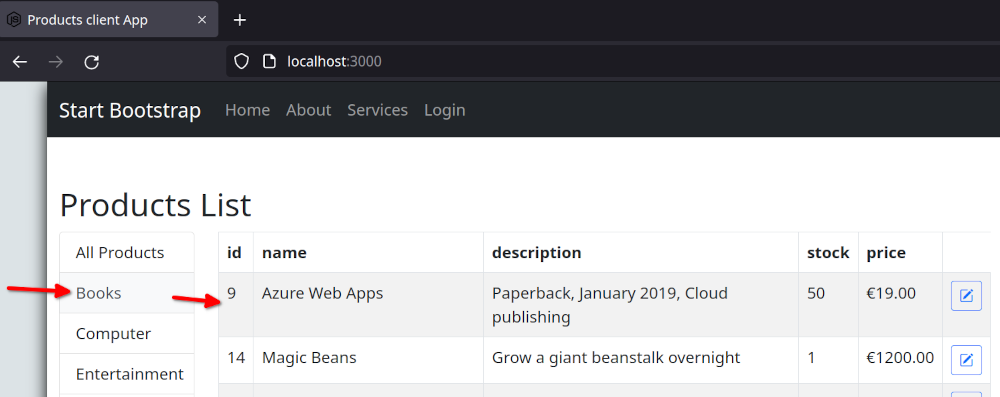


### 3.3 Show a Category select list in the add/ update Product form

Currently a user needs to know the id of a category and enter it in a text input. Replace that with a select box.

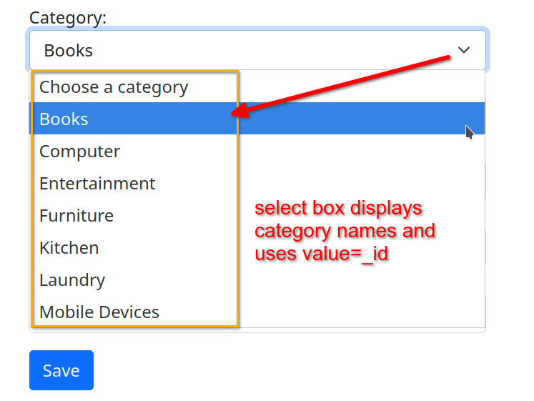

1. Edit **index.html** and replace the form text input with a select

   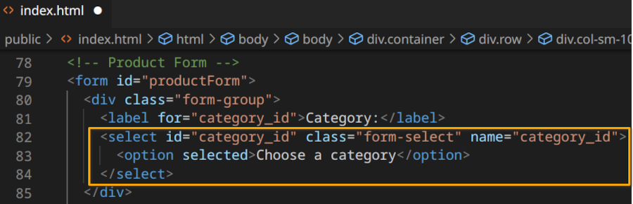


2. Modify the ***```displayCategories()```*** function.

   Add the following JavaScript at the end of the function *- read the code comments for details.*

```javascript
  //
  // *** Fill select list in product form ***
  // first get the select input by its id
  let catSelect = document.getElementById("category_id");

  // remove any existing options from the select
  // loop and keep deleting until no first item/ child remaining
  while (catSelect.firstChild)
    catSelect.removeChild(catSelect.firstChild);

  // Add a select option for each category
  // iterate through categories adding each to the end of the options list
  // each option is made from categoryName, categoryId
  // Start with default option
  catSelect.add(new Option("Choose a category", "0"))
  for (let i = 0; i < categories.length; i++) {
    catSelect.add(new Option(categories[i].category_name, categories[i]._id));
  }
} // end function
```

3. Test the update

   You should see the new select list in the form.
